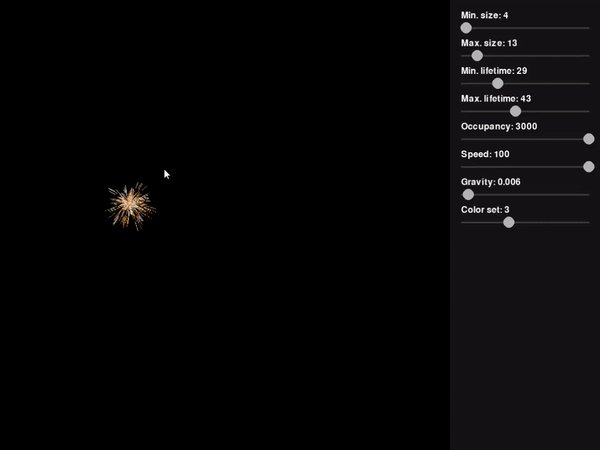

# Simulations Repository

This repository contains a simulation called "Sparks." The simulation is visualized using the Pygame library and demonstrates the movement and interaction of sparks.

## Demonstration

Here's a GIF showcasing the "Sparks" simulation in action:

## Simulation Controls

- Mouse Button Down: Enable panel editing mode.
- Mouse Button Up: Disable panel editing mode.

## Panel Editing

While in panel editing mode, you can modify the simulation parameters using the mouse:

- Min. size: Adjust the minimum size of the sparks.
- Max. size: Adjust the maximum size of the sparks.
- Min. lifetime: Adjust the minimum lifetime of the sparks.
- Max. lifetime: Adjust the maximum lifetime of the sparks.
- Occupancy: Adjust the maximum number of sparks on the screen.
- Speed: Adjust the speed of the sparks.
- Gravity: Adjust the gravity force acting on the sparks.
- Color set: Select a color set for the sparks.

Note: To modify a parameter, click and drag the corresponding slider.

## Exiting the Simulation

To exit the simulation, press the **Esc** key or close the simulation window.

Enjoy the "Sparks" simulation!
